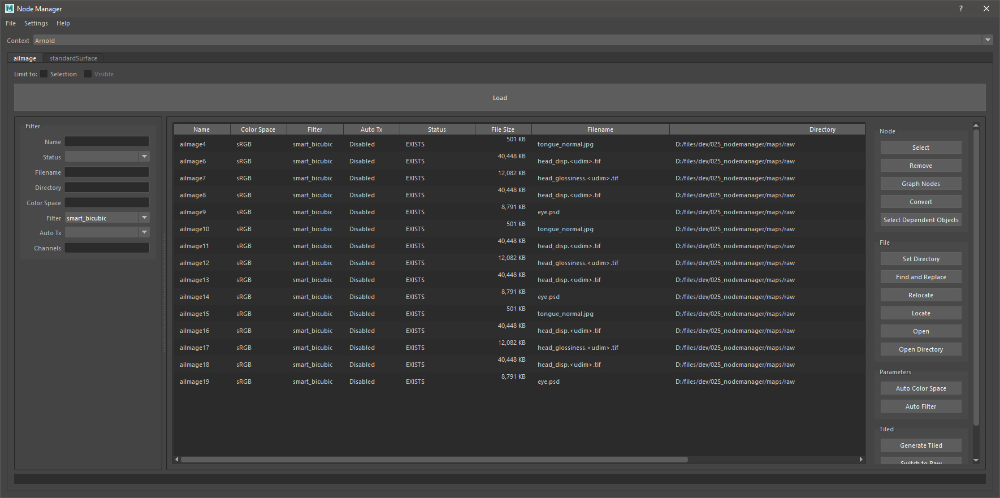

# node-manager

Edit multiple node attributes of the same type (Bitmaps, Materials, ...) at the same time in a dcc (Maya, 3ds Max).\
[List of supported plugins](#supported-features)

## Installation for Maya
1. Click on the code button above and download the package as a .zip file.
2. Unpack the zip archive.
3. Drag the setup_maya.mel file into the viewport of maya.
4. This creates a button on the shelf that can be used to launch the tool.

If preferred the package can be installed manually by moving the nodemanager directory into a location where it can be loaded as a python package by maya. The tool can then be ran with the following code:
```
from nodemanager.plugins.maya import run
window = run()
```

## Getting Started
1. Set a context.
2. Set a node type.
3. Load nodes.
4. Edit attributes by double clicking on the items in the table or right-click > Edit Selected.
5. Show and hide columns by right clicking on the header.
6. Filter items by bringing the display view from the left by dragging the handle.
7. Run actions by pressing the buttons from the action view on the right on selected nodes.




## Actions
Here are some of the actions that can be run on nodes:

### Remove
This just deletes the selected node. It does not preserve any connections.

### Graph Nodes
Graph the selected nodes in the hypergraph.

### Find and Replace
Find and replace on the string in the filepath attribute of file nodes.


### Relocate
Copy or move files from their current location to a new specified folder.\
If the option `Preserve parent directory` is checked, and a `C:\target_directory` as the target directory, a texture will be copied from `C:\parent_directory\source_file.jpg` to `C:\target_directory\parent_directory\source_file.jpg`.

### Locate
If the textures do not exist on disk, this action can locate it by searching all sub directories of the specified path.

### Auto Color Space
This is meant as an example action to show what might be possible. Auto Color Space just sets the color space based on what channel the texture is plugged into. However this does not work if a mask is plugged into a layered texture in a color channel. Use with caution.

### Auto Filter
Resets the filter and filter bias attributes.

### Generate Tiled
This generates .tx files of the selected nodes. If the directory contains `raw` it will be replaced by `tiled`.


## Settings
The important settings for the user are listed under `[general]` or the current dcc header such as `[maya]`.\
`load_on_open`: Should the nodes be loaded when the window is opened.\
`maketx_path`: the path to maketx.exe

maya:
`use_bump2d`: set this to true if you prefer the native bump2d node.

## Supported Features
The tool is built with a plugin system to easily extend the functionality to different dccs and renderers. Here is a list of currently supported features. Please reach out if there are any features you would like to be supported.

### DCCs
- [x] Maya
- [ ] 3ds Max

### Plugins
- [x] maya_native_file
- [ ] maya_native_lambert
- [x] maya_arnold_aiImage
- [x] maya_arnold_standardSurface
